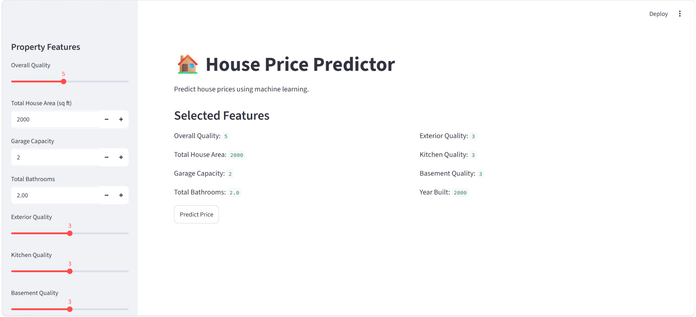
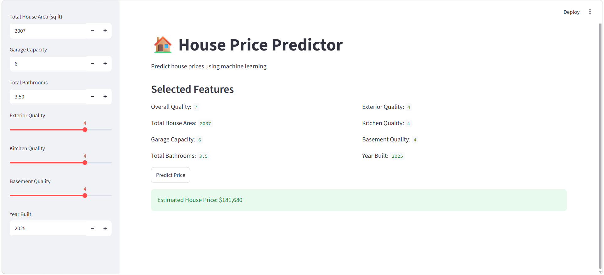

# 🏠 House Price Prediction

Machine learning project that predicts house prices using housing features and regression models.

## 📌 Project Overview

This project focuses on building a regression model to estimate house prices based on property characteristics.

The workflow includes data cleaning, exploratory data analysis, feature engineering, model training, evaluation, and an interactive Streamlit application.

## 📊 Model Performance

| Metric | Value |
|---|---:|
| R² Score | 0.8807 |
| MAE | 18,980 |
| RMSE | 30,249 |

## 🛠️ Technologies Used

- Python
- Pandas
- NumPy
- Scikit-learn
- Streamlit
- Matplotlib
- Seaborn

## 🚀 Key Features

- Data cleaning and preprocessing
- Missing value handling
- Feature engineering
- Regression modeling
- Model evaluation
- Interactive Streamlit interface

## 📷 Application Preview

## 📷 Application Preview





## 📁 Project Structure

```text
house-price-predictor/
├── app.py
├── requirements.txt
├── house_price.ipynb
├── README.md
└── screenshots/
